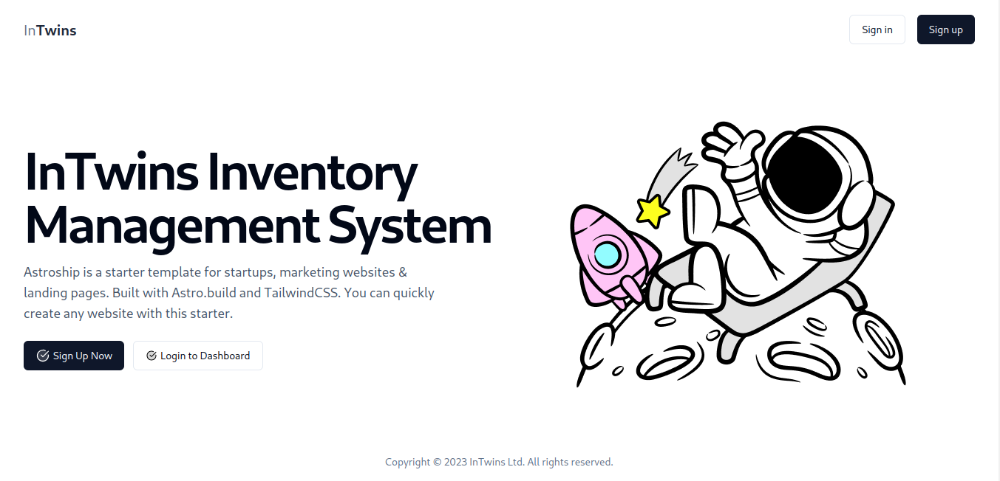

<h1 align="center"> Inventory Management System</h1>

<p align="center">

</p>
**Environment Requirements**

1. NodeJs
2. Docker
3. pnpm
4. git

**Starting the development environment:**

1. Set the environment variables for server:

Copy the `.env.example` to `.env.development`

```
cd server
cp .env.example .env.development
```

Now fill up the variables.

2. Start the database:

- Start docker engine (For windows)
- Start postgres container

```
pnpm db:up
```

3. Run database migration and prisma client generation:

```
pnpm prisma:migrate
pnpm prisma:generate
```

4. Start the server:

```
pnpm server:dev
```

5. Start the client:

```
pnpm web:dev
```
